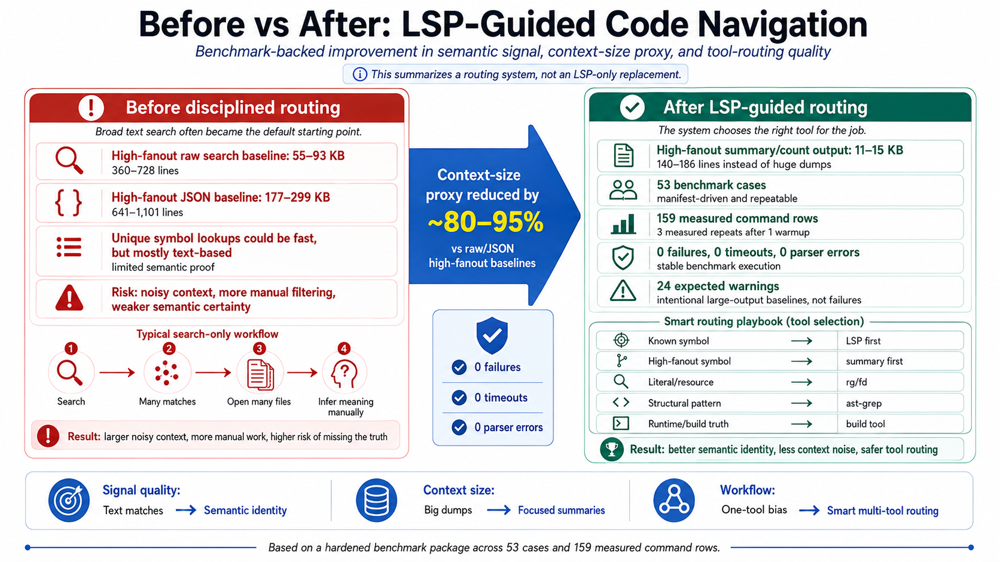

# agent-code-router-kit

A public toolkit for teaching AI coding agents how to route Swift/iOS and Android/Kotlin codebase work to the right evidence layer.

The core idea is simple: an agent should not treat text search as code understanding. It should classify the task, choose the right tool, and keep semantic, structural, discovery, and runtime evidence separate.

## Problem

AI coding agents often start with broad search, read too many files, and infer relationships from matching text. That works for literal strings, but it is weak for Swift code identity:

- a class name can appear in comments, strings, generated files, or unrelated namespaces;
- protocols, conformances, overloads, and extension namespaces are semantic relationships, not just text;
- high-fanout names like `Resolver`, `Router`, `Service`, `Manager`, and `ViewModel` can flood the model context;
- XIB, storyboard, localization, generated, and resource surfaces are not fully represented by Swift symbol graphs;
- successful symbol lookup does not prove the app builds or runs.

## Solution

Route each task to the evidence layer that can actually prove it.

<p align="center">
  
</p>

The image above summarizes the core workflow change: broad text search is no
longer treated as semantic proof. The agent classifies the task, uses
SourceKit-LSP or Serena for Swift symbol identity, uses grouped summaries for
high-fanout symbols, keeps `rg` / `fd` for literal and resource discovery, uses
`ast-grep` for syntax-shaped patterns, and leaves build/runtime proof to the
project's build or Xcode/plugin layer.

| Task | First tool | Why |
|---|---|---|
| Known Swift symbol | SourceKit-LSP / Serena | Proves semantic identity, definitions, references, protocols, overloads, extension namespaces, and diagnostics |
| Known Kotlin/Java symbol | Serena / Kotlin or Java LSP | Proves semantic identity, definitions, references, implementations, packages, and diagnostics |
| High-fanout Swift symbol | LSP grouped counts first | Keeps semantic correctness without dumping every reference into context |
| Literal/resource lookup | `rg` / `fd` | Best for strings, logs, route keys, file discovery, localization, resources, and generated surfaces |
| GraphQL query/schema work | GraphQL tools + `rg` / `fd` | Serena does not provide native GraphQL LSP routing; generated Kotlin/Swift can be handled semantically after discovery |
| Structural Swift/Kotlin pattern | `ast-grep` | Matches syntax-shaped patterns and migration candidates more safely than regex |
| Build/runtime truth | Xcode, Android Studio, Gradle, plugin, CI, or build system | Proves compile, test, simulator/emulator, UI, and runtime behavior |

## Quick Start

Clone the toolkit, then make sure the minimum same-results dependency gate
passes. That gate verifies the portable baseline needed before another agent
should expect the same routing behavior:

```text
1. Xcode with SourceKit-LSP
2. xcode-build-server
3. Serena or an equivalent agent-facing LSP access layer
4. rg / fd / ast-grep
```

If any of those are missing, the agent can still read the policy, but it should
not claim the same Swift/iOS LSP-guided behavior or benchmark conclusions yet.

```bash
git clone <your-fork-or-copy>
cd agent-code-router-kit

bash scripts/setup/check-swift-ios-prereqs.sh
bash scripts/setup/check-android-prereqs.sh
python3 scripts/benchmarks/shared/benchmark_runner.py --validate \
  --cases benchmarks/ios/cases.example.tsv
python3 scripts/benchmarks/shared/benchmark_runner.py --validate \
  --cases benchmarks/android/cases.sample.tsv
python3 scripts/benchmarks/android/studio_semantic_probe.py --validate \
  --cases benchmarks/android/studio-semantic-cases.sample.tsv
python3 scripts/benchmarks/android/serena_source_symbol_probe.py --validate \
  --cases benchmarks/android/serena-source-symbol-cases.sample.tsv
python3 scripts/benchmarks/android/serena_project_server_probe.py --validate \
  --cases benchmarks/android/serena-project-server-cases.sample.tsv
python3 scripts/benchmarks/android/process_state_probe.py --validate
python3 scripts/benchmarks/android/project_model_probe.py --validate \
  --cases benchmarks/android/project-model-cases.sample.tsv
python3 -m unittest discover -s tests -p 'test_*.py'
python3 scripts/benchmarks/shared/check_public_sanitization.py
```

For a full Android/Kotlin routing benchmark over two Android repos, use the
suite runner:

```bash
python3 scripts/benchmarks/android/run_benchmark_suite.py \
  --sample-b2b-repo /path/to/sample-b2b-android-app \
  --sample-retail-repo /path/to/sample-retail-android-app
```

This runs default `rg` / `fd` / `ast-grep` measurements, Android Studio
semantic probes, Serena/Kotlin LSP source-symbol probes, Serena ProjectServer
semantic probes, process-state checks, project-model readiness checks, and report generation. The
project-model check is preflight-only unless `--run-gradle-project-model` is
passed.

For a strict Android regression run after intentionally cleaning stale
Serena/LSP processes:

```bash
python3 scripts/benchmarks/android/run_benchmark_suite.py \
  --require-clean-process-state \
  --enforce-assertions \
  --sample-b2b-repo /path/to/sample-b2b-android-app \
  --sample-retail-repo /path/to/sample-retail-android-app
```

For the Sample B2B-first Android operational hardening gate, use the real open
Android Studio/emulator setup:

```bash
python3 scripts/benchmarks/android/operational_gate.py \
  --sample-b2b-repo /path/to/sample-repos/sample-b2b-android-app \
  --device emulator-5554 \
  --variant stagingDebug \
  --enforce-assertions
```

This stable gate checks Android Studio declaration/usages recovery,
Serena/Kotlin semantic proof, generated-source readiness, high-fanout summary
discipline, Gradle 8.13 project-model/build proof, APK install, and package
launch smoke on Sample B2B as a testbed. Sample Retail now has a separate stable operational
follow-up gate against its Gradle 9 project model.

To expand the Android Studio proof beyond one smoke symbol, run the stable Studio
symbol matrix:

```bash
python3 scripts/benchmarks/android/studio_symbol_matrix.py \
  --validate --run \
  --repo sample_b2b=/path/to/sample-repos/sample-b2b-android-app \
  --enforce-assertions
```

This matrix requires expected declaration and usage files across ViewModels,
methods, DI properties, services, network code, request builders, and
generated/broad-symbol boundaries before Studio becomes a secondary semantic
proof layer.

Latest Sample B2B matrix result:

```text
case_count: 16
trusted_studio_layer: true
declaration_pass_count: 15
usage_pass_count: 16
assertions: pass=18, warn=2, fail=0
```

The warning is the expected generated `BuildConfig` boundary, not a Studio
command failure.

To prove generated-source mapping separately from semantic navigation, run:

```bash
python3 scripts/benchmarks/android/generated_semantic_mapping.py \
  --validate --run \
  --repo sample_b2b=/path/to/sample-repos/sample-b2b-android-app \
  --run-build-proofs \
  --enforce-assertions
```

Latest Sample B2B generated-source result:

```text
case_count: 5
mapping_pass_count: 5
semantic_pass_count: 2
assertions: pass=14, warn=3, fail=0
```

Apollo generated query/mutation flows are Studio-semantic-proven and
build-proven. Room, Moshi KSP, and BuildConfig are build-proven generated
boundaries, not semantic navigation successes.

High-fanout summaries now use a shared output budget helper:

```text
scripts/benchmarks/shared/output_budget.py
```

Latest Sample B2B high-fanout result:

```text
assertions: pass=10, warn=8, fail=0
UseCase:     262 files / 1813 matches / budget warn
ViewModel:   101 files / 330 matches / budget pass
Repository:  175 files / 676 matches / budget warn
Mapper:       16 files / 30 matches / budget pass
Service:     156 files / 1447 matches / budget warn
Module:       40 files / 93 matches / budget pass
```

For an Xcode project, create a machine-local `buildServer.json`:

```bash
./scripts/setup/create-build-server-json.sh \
  --project YourApp.xcodeproj \
  --scheme "Your Scheme"
```

or:

```bash
./scripts/setup/create-build-server-json.sh \
  --workspace YourApp.xcworkspace \
  --scheme "Your Scheme"
```

For an Android/Kotlin project, create a Serena project with Kotlin and JSON language servers:

```bash
cd /path/to/android-repo

serena project create \
  --language kotlin \
  --language json

serena project health-check .
```

Start with Kotlin and JSON. Include `--language java` only when Java semantic
proof is needed and Gradle/Android Studio sync is known healthy.

Or use the wrapper:

```bash
./scripts/setup/create-android-serena-project.sh \
  --target-repo /path/to/android-repo
```

For Android, prove one real `.kt` source declaration before running full Serena indexing. Generic health checks can accidentally target `build.gradle.kts`, which may return no symbols even when Kotlin LSP is working.

Also verify the Android project model before blaming the semantic layer:

```bash
bash scripts/setup/check-android-prereqs.sh \
  --target-repo /path/to/android-repo
```

This reports missing required `local.properties` keys by name only. It does not
print or create secret values. If Gradle sync cannot configure the app, Android
Studio, Serena JetBrains, and Kotlin LSP may be diagnostic-ready but not
reference-proof-ready.

The same gate also reports installed Android Studio apps, whether Android
Studio Preview/Quail is running, and whether `android studio check` sees the
exact target repo as open. Treat this as readiness evidence only; run a
declaration/usages smoke test before using Android Studio CLI as symbol proof.

If Android LSP behavior looks stale, inspect duplicate Serena/LSP sessions
without killing anything:

```bash
bash scripts/setup/repair-serena-android-sessions.sh --dry-run
```

Only after intentionally reconnecting active agents, stop stale sessions
explicitly:

```bash
bash scripts/setup/repair-serena-android-sessions.sh --kill
```

After cleanup, prove the session state is clean:

```bash
python3 scripts/benchmarks/android/process_state_probe.py \
  --validate --run \
  --target-project-path /path/to/sample-repos/sample-b2b-android-app \
  --require-clean \
  --enforce-assertions \
  --output results/android/process-state
```

The strict process gate is project-aware: it separates target-project Serena
MCP sessions from other-project sessions, unknown ownership, and controlled
streamable-HTTP server mode. Use `--allow-other-project-serena` only when other
active Serena/Codex sessions are intentional. Latest Sample B2B snapshot:
target-owned Serena MCP sessions were `0`, other-project Serena sessions were
`4`, unknown sessions were `0`; the normal project-aware probe warned, while
the explicit `--allow-other-project-serena --require-clean` run passed with
6 pass / 0 warn / 0 fail. That proves project-aware strict behavior, not a
clean-room shutdown of every active Serena session.

To make that distinction count as an explicit readiness acceptance instead of an
implicit shortcut, record a project-aware scope acceptance artifact:

```bash
python3 scripts/benchmarks/android/process_scope_acceptance.py \
  --accept-project-aware-strictness \
  --accepted-by "<name-or-role>" \
  --reason "Other Serena sessions are intentionally active for unrelated projects; target-project ownership is clean."
```

Without `--accept-project-aware-strictness`, this script writes a template-only
artifact and does not satisfy the readiness clean-process gate.

Android Studio / Quail can add an IDE-backed semantic layer:

```bash
android studio check
android studio analyze-file --project <project-name> <real-source-file.kt>
```

Do not assume `android studio find-declaration` or `find-usages` are reliable
until they pass a source-symbol smoke test on the current repo. See
`docs/android/studio-symbol-matrix.md`.

To diagnose why Android semantic lookup is unavailable, run:

```bash
python3 scripts/benchmarks/android/project_model_probe.py \
  --validate --run \
  --cases benchmarks/android/project-model-cases.sample.tsv \
  --repo sample_b2b_android=/path/to/sample-b2b-android-app \
  --repo sample_retail_android=/path/to/sample-retail-android-app \
  --output results/android/project-model
```

The probe reports missing project-model prerequisites without printing secret
values.

To generate only a combined Android benchmark report from the latest artifacts:

```bash
python3 scripts/benchmarks/android/generate_report.py \
  --results-root results/android \
  --output results/android/android-benchmark-report-$(date +%F).md
```

## Install The Policy In An Agent

Use these templates:

- `templates/AGENTS.md` for project instructions.
- `templates/codebase-tool-router/SKILL.md` for Codex-style skill routing.
- `templates/android-codebase-tool-router/SKILL.md` for Android/Kotlin-specific routing.
- `templates/codex/` for Codex setup notes.
- `templates/cursor/` for Cursor rules.
- `templates/claude/` for Claude-style instructions.

For a guided install that is read-only by default:

```bash
./scripts/setup/agent-self-install.sh \
  --target-repo /path/to/ios-repo \
  --agent codex \
  --profile swift-ios \
  --dry-run
```

For Android:

```bash
./scripts/setup/agent-self-install.sh \
  --target-repo /path/to/android-repo \
  --agent codex \
  --profile android \
  --dry-run
```

See `docs/agents/agent-self-install.md`.

Minimal prompt:

```text
Use the codebase tool router.

Classify the task before searching:
- known Swift symbol -> SourceKit-LSP / Serena
- known Kotlin/Java symbol -> Serena / Kotlin or Java LSP
- high-fanout symbol -> LSP grouped counts first
- literal/resource -> rg/fd
- structural Swift/Kotlin pattern -> ast-grep
- build/runtime proof -> Xcode/plugin/build system
- Android build/runtime proof -> Gradle/Android Studio/emulator/CI
- GraphQL -> GraphQL tools + rg/fd first, then LSP for generated source

Do not dump high-fanout references.
Do not claim runtime proof from LSP or search.
```

## Benchmark Layout

The benchmark package is now stable and versionless. Files are grouped by platform and by shared infrastructure:

```text
benchmarks/android/             Android TSV manifests and Android benchmark README
benchmarks/ios/                 Swift/iOS TSV manifest, fixture, and sample results
scripts/benchmarks/android/     Android probes and operational gates
scripts/benchmarks/ios/         iOS entrypoint wrapper
scripts/benchmarks/shared/      generic TSV runner, sanitization, and output budget helpers
tests/android/                  Android benchmark tests
tests/ios/                      iOS benchmark tests
tests/shared/                   shared runner and setup tests
```

The public interface is organized by capability, not by historical milestone name:

- routing benchmark
- operational gate
- reference triage
- Studio symbol matrix
- generated-source mapping
- transport and lifecycle probes
- readiness audit
- high-fanout output budget

## Benchmark Summary

The benchmark package is sanitized and public-safe. It captures routing conclusions without private project names, raw private output, credentials, or organization-specific paths.

Swift/iOS fixture results demonstrate that broad raw search can flood context, while grouped file/count summaries keep high-fanout work bounded. Android/Kotlin results demonstrate the same routing principle under Android-specific constraints: Gradle project model, generated sources, Android Studio indexing, emulator/runtime proof, and Serena/Kotlin LSP process lifecycle must stay separate proof layers.

Core routing rule:

```text
Known Swift symbol       -> SourceKit-LSP / Serena first
Known Kotlin/Java symbol -> Serena / Kotlin or Java LSP first, after readiness smoke
High-fanout symbol       -> grouped summaries/counts first
Literal/resource         -> rg/fd first
GraphQL/generated        -> GraphQL/discovery/build mapping first, then semantic symbol proof if concrete
Structural pattern       -> ast-grep first
Build/runtime truth      -> Xcode, Android Studio, Gradle, emulator/device, CI, or plugin proof
```

Android operational gates are intentionally conservative. A passing build/install/launch smoke proves only build/runtime smoke, not business-flow correctness. Empty Serena references are treated as a named semantic disagreement when Android Studio usages returns real locations; the policy then records which layer is trusted for that pattern instead of silently accepting either result.

## Proof Boundaries

This toolkit does not claim that:

- LSP proves runtime behavior;
- `rg` proves all real symbol references;
- `ast-grep` proves types;
- Xcode/Android Studio/Gradle/build output replaces semantic navigation;
- generated files, XIB/storyboard, localization, and resource behavior are fully semantic;
- future agent behavior will always follow the policy without instruction.

See `docs/concepts/proof-boundaries.md`.

## Documentation

- `docs/concepts/tool-routing-model.md`
- `docs/concepts/lsp-vs-search.md`
- `docs/concepts/high-fanout-symbols.md`
- `docs/concepts/proof-boundaries.md`
- `docs/swift-ios/sourcekit-lsp-setup.md`
- `docs/swift-ios/xcode-build-server.md`
- `docs/swift-ios/serena-sourcekit-lsp.md`
- `docs/swift-ios/xcode-plugin-proof-layer.md`
- `docs/android/kotlin-serena-lsp-setup.md`
- `docs/android/android-routing-policy.md`
- `docs/android/operational-gates.md`
- `docs/android/reference-triage.md`
- `docs/android/studio-symbol-matrix.md`
- `docs/android/readiness-audit.md`
- `docs/android/operational-completion.md`
- `docs/android/sample-retail-follow-up.md`
- `docs/android/android-benchmark-results-2026-05-24.md`
- `docs/agents/generic-agent-policy.md`
- `docs/agents/agent-self-install.md`
- `docs/benchmarks/methodology.md`
- `docs/benchmarks/interpreting-results.md`
- `docs/benchmarks/proven-boundaries.md`
- `docs/benchmarks/history.md`

## Public Safety

Do not publish raw benchmark output from private repositories without sanitizing paths, names, source snippets, credentials, and organization-specific details.
