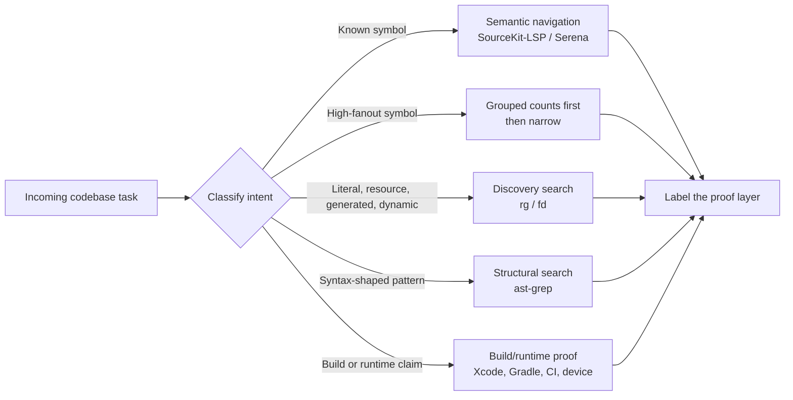
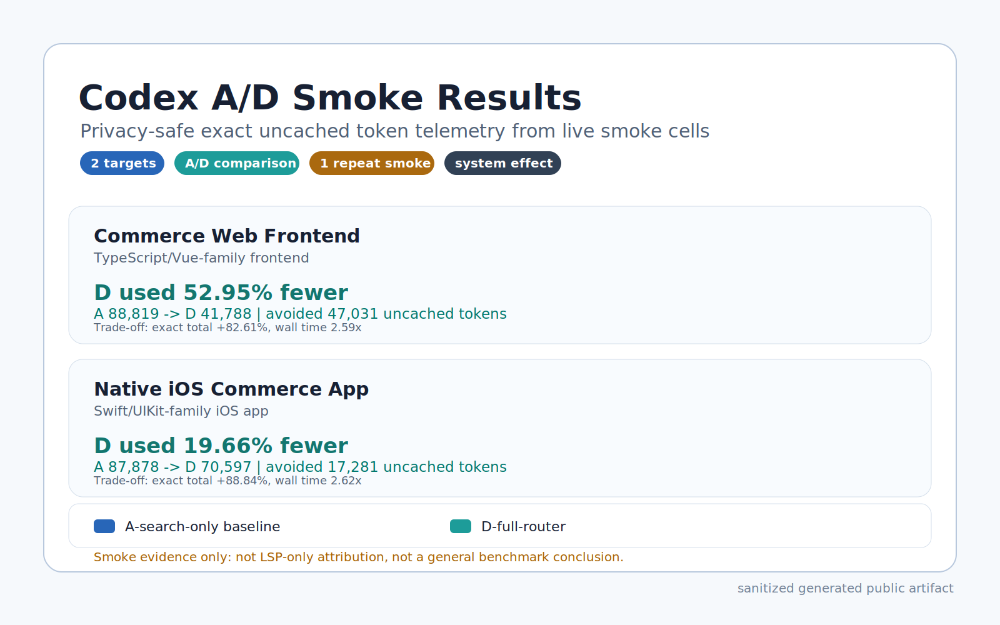

# agent-code-router-kit

A public toolkit for teaching AI coding agents how to route codebase work to the right evidence layer instead of treating broad text search as code understanding.

The kit is useful when an agent needs to answer questions in Swift/iOS, Android/Kotlin, web/frontend, or mixed codebases while keeping semantic navigation, literal discovery, structural search, and runtime proof separate.

## Why This Exists

AI coding agents often start with broad search, read too many files, and infer relationships from matching text. That works for literal strings, but it is weak evidence for code identity:

- a symbol can appear in comments, strings, generated files, or unrelated namespaces;
- protocols, conformances, overloads, extension namespaces, and implementations are semantic relationships;
- high-fanout names such as `Resolver`, `Router`, `Service`, `Manager`, and `ViewModel` can flood the model context;
- resource, localization, storyboard/XIB, generated, and dynamic surfaces are not fully represented by a source symbol graph;
- successful symbol lookup does not prove the app builds, launches, or behaves correctly.

## Routing Model

Route each task to the evidence layer that can actually prove it.



The boundary matters: text matches are not semantic references, LSP results are not build proof, and a launch smoke is not business-flow correctness.

| Task | First proof layer |
|---|---|
| Known Swift/iOS symbol | SourceKit-LSP or Serena semantic navigation |
| Known Kotlin/Java symbol | Serena / Kotlin or Java LSP after readiness smoke |
| High-fanout symbol | grouped counts first, then focused semantic or search narrowing |
| Literal/resource/generated lookup | `rg` / `fd` discovery first |
| GraphQL query/schema work | GraphQL tooling plus discovery search, then generated-source semantic proof if concrete |
| Syntax-shaped migration or audit | `ast-grep` first |
| Build, test, simulator, emulator, UI, runtime | Xcode, Gradle, Android Studio, CI, plugin, or device proof |

## Current Results Summary

The repository includes a privacy-safe Codex A/D live smoke bundle under [`benchmarks/real-agent-routing/evidence/codex-ad-smoke-anonymized/`](benchmarks/real-agent-routing/evidence/codex-ad-smoke-anonymized/README.md).

The two private targets are described only by their technical nature:

- a production commerce web frontend with a TypeScript/Vue-family surface;
- a production native iOS commerce app with a Swift/UIKit-family surface.

Company names, repository names, local paths, raw prompts, transcripts, final answers, and exact private repository commits are intentionally omitted.

<p align="center">
  
</p>

The smoke compared `A-search-only` against `D-full-router` on one known-symbol definition task per private target:

| Anonymous target | A exact uncached | D exact uncached | Uncached tokens avoided | Uncached-token reduction |
|---|---:|---:|---:|---:|
| Commerce web frontend | 88,819 | 41,788 | 47,031 | 52.95% |
| Native iOS commerce app | 87,878 | 70,597 | 17,281 | 19.66% |

In these smoke runs, `D-full-router` reduced uncached token use and model-visible tool output, but processed more total cached context and took roughly 2.6x as long. This is a context-efficiency result, not an overall compute or latency reduction.

Read this as smoke evidence only. It proves the live harness can hard-isolate a search-only baseline, run a Serena-enabled full-router treatment, capture exact uncached token telemetry, and observe tool evidence. It does not prove LSP-only causality, generalize across task families, or estimate run-to-run variance. The A/D comparison is a full-router system effect.

## Start Here

Install or validate the routing policy for a target project:

```bash
python3 scripts/setup/serena-doctor.py \
  --target-repo /path/to/repo \
  --profile swift-ios|android|python|generic \
  --json

./scripts/setup/agent-self-install.sh \
  --target-repo /path/to/repo \
  --agent codex|claude|cursor|generic \
  --profile swift-ios|android|python|all \
  --dry-run
```

Validate this repository locally:

```bash
bash scripts/setup/check-swift-ios-prereqs.sh
python3 scripts/benchmarks/shared/benchmark_runner.py --validate \
  --cases benchmarks/ios/cases.example.tsv
python3 -m unittest discover -s tests -p 'test_*.py'
python3 scripts/benchmarks/shared/check_public_sanitization.py
```

For the complete setup guide and real-agent dry-run commands, see
[`docs/getting-started.md`](docs/getting-started.md) and
[`docs/benchmarks/real-agent-routing-operations.md`](docs/benchmarks/real-agent-routing-operations.md).

## Documentation Guide

| Area | Start with |
|---|---|
| First local setup | [`docs/getting-started.md`](docs/getting-started.md) |
| Core routing model | [`docs/concepts/tool-routing-model.md`](docs/concepts/tool-routing-model.md) |
| LSP versus search boundaries | [`docs/concepts/lsp-vs-search.md`](docs/concepts/lsp-vs-search.md) |
| High-fanout symbols | [`docs/concepts/high-fanout-symbols.md`](docs/concepts/high-fanout-symbols.md) |
| Proof boundaries | [`docs/concepts/proof-boundaries.md`](docs/concepts/proof-boundaries.md) |
| Serena setup and integration | [`docs/serena/README.md`](docs/serena/README.md) |
| Agent install templates | [`docs/agents/agent-self-install.md`](docs/agents/agent-self-install.md) |
| Swift/iOS SourceKit-LSP | [`docs/swift-ios/sourcekit-lsp-setup.md`](docs/swift-ios/sourcekit-lsp-setup.md) |
| Xcode build-server setup | [`docs/swift-ios/xcode-build-server.md`](docs/swift-ios/xcode-build-server.md) |
| Xcode proof layer | [`docs/swift-ios/xcode-plugin-proof-layer.md`](docs/swift-ios/xcode-plugin-proof-layer.md) |
| Android/Kotlin operations | [`docs/android/android-benchmark-operations.md`](docs/android/android-benchmark-operations.md) |
| Real-agent benchmark operations | [`docs/benchmarks/real-agent-routing-operations.md`](docs/benchmarks/real-agent-routing-operations.md) |
| Real-agent interpretation | [`docs/benchmarks/interpreting-real-agent-results.md`](docs/benchmarks/interpreting-real-agent-results.md) |
| Token measurement strategy | [`docs/benchmarks/token-measurement-strategy.md`](docs/benchmarks/token-measurement-strategy.md) |
| Anonymized smoke evidence | [`benchmarks/real-agent-routing/evidence/codex-ad-smoke-anonymized/`](benchmarks/real-agent-routing/evidence/codex-ad-smoke-anonymized/README.md) |

## Repository Layout

```text
benchmarks/ios/                 Swift/iOS manifests, fixtures, and sample results
benchmarks/android/             Android/Kotlin manifests and sample results
benchmarks/real-agent-routing/  Real-agent tasks, route profiles, contracts, and sanitized results
scripts/setup/                  Readiness checks and project install helpers
scripts/benchmarks/             Benchmark runners, probes, reports, audits, and sanitizers
scripts/agents/                 Subject-agent adapters and terminal bridges
templates/                      Portable agent instructions and skill templates
docs/                           Focused operating guides and conceptual documentation
tests/                          Unit and integration regression coverage
```

## Public Safety

Do not publish raw benchmark output from private repositories. Sanitize paths, names, source snippets, credentials, transcripts, raw prompts, final answers, and organization-specific details before committing evidence. The current public smoke bundle intentionally publishes only anonymized target descriptions and aggregate telemetry.
